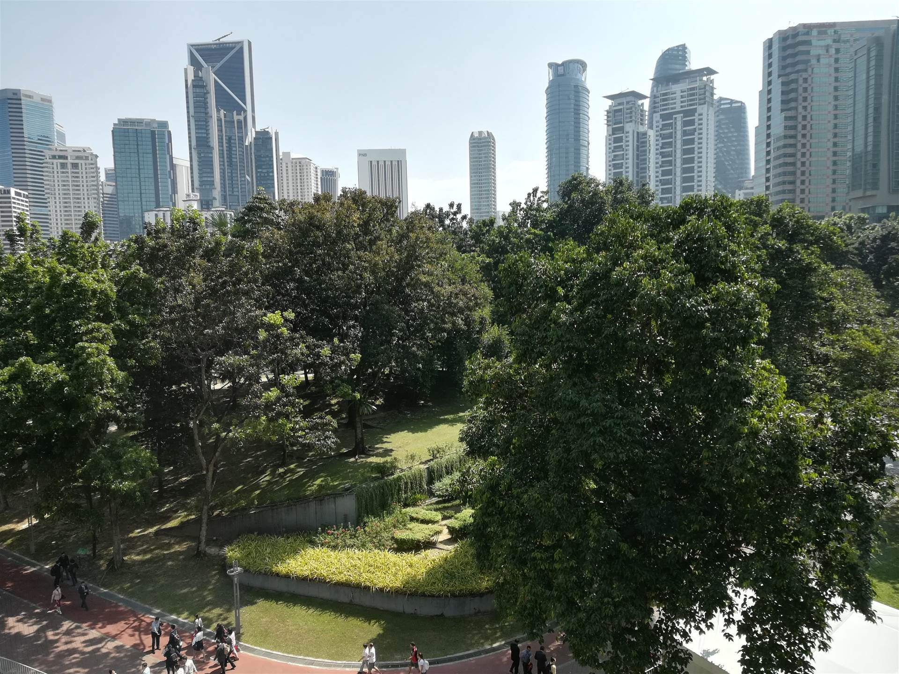

## Hello World
Hi, I’m Sean, an M.S. Computer Science student at Georgia Tech, on track to graduate in December 2025, specializing in machine learning. I earned my bachelor’s degree in Computer Science from Georgia Tech in May 2024, with concentrations in artificial intelligence and information internetworks, along with a minor in economics. I’m excited to leverage cutting-edge technology to build innovative, real-world solutions.

## About Me
[Feel free to connect with me on LinkedIn](https://www.linkedin.com/in/sliu750)

[My Resume](Sean_Liu_Resume.pdf)

## Experiences

  

    

    

      
      

        <h3>Georgia Tech College of Computing</h3>
        
Graduate Teaching Assistant August 2025 – Present

      

    

    

      <ul>
        <li>Support professors in managing the data and visual analytics (CSE 6242) course with 1,200+ students by developing homework assignments, assisting with grading, and coordinating communication with students</li>
        <li>Conduct weekly office hours to provide guidance and answer students’ questions, helping students with homework, team projects, and conceptual understanding</li>
        <li>Mentor students in key data science skills and technologies, including data processing and visualization, big data tools (e.g. AWS, PySpark), and machine learning</li>
      </ul>
    

  

  

    

    

      
      

        <h3>Charles Schwab</h3>
        
Software Engineering Intern June 2025 – August 2025

      

    

    

      <ul>
        <li>Built and enhanced internal software to streamline AI-driven model risk management workflows, increasing efficiency and ensuring compliance with regulatory standards</li>
        <li>Pioneered the process of automated model reporting, writing Python scripts to query SQL databases, compute model performance metrics, summarize metrics with Azure AI, and produce visualizations aligned with industry reporting formats</li>
      </ul>
    

  

  

    

    

      
      

        <h3>Georgia Tech Financial Services Innovation Lab</h3>
        
Research Assistant June 2024 – June 2025

      

    

    

      <ul>
        <li>Promoted to graduate research assistant after initial volunteer role, advancing from researching financial applications of large language models to developing AI-driven tools for financial and economic decision-making</li>
        <li>Implemented Python-based systems to aggregate financial data and legislation, contributing to model training, and evaluated the predictive and decision-making capabilities of large language models in financial contexts</li>
        <li>Facilitated collaboration across faculty, staff, and interns, while supervising and mentoring a team of 20 research interns on data curation, coding, and model and application development</li>
      </ul>
    

  

  

    

    

      
      

        <h3>Vertically Integrated Project</h3>
        
Researcher August 2022 – December 2023

      

    

    

      <ul>
        <li>Contributed to the Autonomous and Connected Transportation (ACT) Driving Simulator, a faculty-led multidisciplinary project that designs accessible, sustainable transportation solutions for smart cities</li>
        <li>Redesigned and optimized existing machine learning and deep learning models in Python, boosting test accuracies from 60% to over 80% in detecting driver distraction and predicting behavior from physiological data, improving road safety</li>
      </ul>
    

  

  

    

    

      
      

        <h3>Alpha Models Inc.</h3>
        
Software Engineering Intern May 2023 – August 2023

      

    

    

      <ul>
        <li>Implemented a C++ simulation model for railcar logistics, applying a constrained shortest path algorithm to optimize shipment routes and improve operational efficiency</li>
        <li>Developed a C++ solution for the Vehicle Routing Problem to automate the scheduling of freight railroad maintenance, enhancing resource allocation and reducing manual planning effort</li>
      </ul>
    

  

## Projects

  

    

    

      
      

        <h3>Environmental Impacts of Agriculture</h3>
      

    

    

      <ul>
        <li>Created <a href="https://syoon029.github.io/6730-Data-Vis-Team-Project.github.io/" target="_blank">interactive visualizations</a> with Tableau, explaning how agriculture impacts greenhouse gas emissions, biodiversity, and energy and water consumption</li>
        <li>Produced visualizations to display trends across the world over the years</li>
        <li>Highlighted main agricultural contributors of environmental challenges, comparing the losses to the outputs</li>
      </ul>
    

  

  

    

    

      
      

        <h3>Machine Learning Powered Analysis of Urban Forests</h3>
      

    

    

      <ul>
        <li>Applied machine learning models (e.g. random forest and gradient boosting classifiers and regressors) and deep learning models (e.g. neural networks) to predict the conditions of urban trees and their impact on public health, particularly in Los Angeles</li>
        <li>Created interactive visualizations displaying the status and diversity of trees around the United States</li>
        <li><a href="team004poster.pdf" target="_blank">Poster</a> and <a href="https://github.com/sliu750/CSE-6242-Team-Project" target="_blank">GitHub repo</a></li>
      </ul>
    

  

  

    

    

      
      

        <h3>Data Science for Real Estate</h3>
      

    

    

      <ul>
        <li>Implemented supervised machine learning models (decision tree, regression) to predict whether someone should rent a house and to estimate the price of a house based on its characteristics</li>
        <li>Applied unsupervised methods (clustering) to group houses by similar features, helping sellers determine a suitable price range</li>
        <li><a href="https://github.com/sliu750/ML4641-Team-Project" target="_blank">GitHub repo</a></li>
        
      </ul>
    

  

## Skills
Throughout my courses and self-studying, I have gained proficiency in a variety of programming languages, frameworks, and libraries.

  
Python

  
Java

  
C

  
C++

  
C#

  
MySQL

  
JavaScript

  
R

  
MATLAB

  
Go

  
AWS

  
Tableau

  
NumPy

  
sklearn

  
PyTorch

  
TensorFlow

  
Git

## Hobbies
Outside of work and studies, I enjoy hitting the gym, experimenting with new recipes in the kitchen, and diving into the latest breakthroughs in AI/ML, history, and the sciences. I love exploring the city I’m in, spending time with friends, and unwinding with some good entertainment- especially We Bare Bears or Calvin and Hobbes. 

